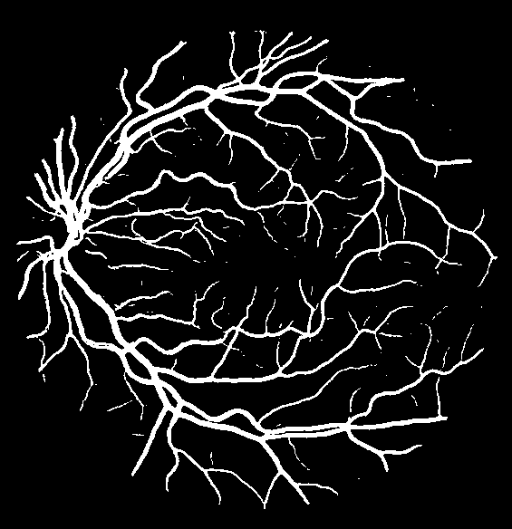

## Environment Configuration（环境配置）
* Python 3.8.19
* Pytorch 1.13.1
* CUDA 11.7
* GPU 3050Ti 4GB

## File Structure （文件结构）

```
  ├── src: Build U-Net model code（搭建U-Net模型代码）
  ├── train_utils: Training, validation modules (训练、验证相关模块)
  ├── my_dataset.py: Custom dataset for reading DRIVE dataset (自定义dataset数据集)
  ├── train.py: Training start-up scripts (训练启动脚本)
  ├── predict.py: Predicting start-up script (预测脚本)
  └── compute_mean_std.py: Mean and standard deviation of each channel (统计各通道的均值和标准差)
```

## Image Comparison （图片对比）
<table>
    <tr>
    <td>label (test set: 1st_manual) </td>
    <td>result</td>

  </tr>
  <tr>
    <td></td>
    <td></td>
  </tr>
</table>

## DRIVED dataset download address （数据集地址）
* [https://drive.grand-challenge.org/](https://drive.grand-challenge.org/)


## Training Methods （训练方法）
* run train.py

## Predicting Methods （预测方法）
* run predict.py

## Additional information （补充信息）
* 本项目U-Net使用双线性插值做为上采样 (This project U-Net uses bilinear interpolation for up-sampling)

